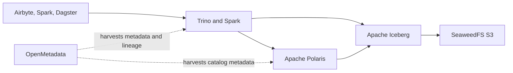

## Target data path

## Component responsibilities

| Component | Responsibility | Does not own |
| --- | --- | --- |
| SeaweedFS | Durable S3-compatible object storage | Table transactions, schema evolution or business metadata |
| Apache Iceberg | Table format, snapshots, partition evolution and atomic table operations | User authentication or enterprise policy administration |
| Apache Polaris | Target Iceberg REST catalog and catalog-level access model | Physical object storage or complete enterprise metadata governance |
| Hive Metastore | Temporary compatibility catalog during migration | Long-term target architecture |
| OpenMetadata | Discovery, ownership, lineage, glossary, quality metadata and governance workflows | Runtime SQL authorization enforcement |
| Trino | Interactive and federated SQL | Durable storage or catalog source of truth |
| Spark | Distributed processing, transformation and maintenance jobs | Central policy management |

## Catalog migration

Hive Metastore and Polaris coexist by workload during migration. A table must have one authoritative catalog registration at a time unless a tested migration tool explicitly guarantees safe synchronization.

Recommended sequence:

1. Inventory Hive tables, storage formats, locations, permissions and engine dependencies.
2. Move eligible datasets to Iceberg while Hive Metastore remains authoritative for compatibility workloads.
3. Validate Spark and Trino against the Iceberg REST catalog in a non-production domain.
4. Migrate catalogs or namespaces to Polaris in controlled waves.
5. Repoint dependent services, validate permissions and lineage, then retire corresponding HMS registrations.
6. Retire Hive Metastore only after no workload, migration utility or rollback plan depends on it.

## Data ownership and layout

- Give every table a clear owner, domain, classification and retention policy in OpenMetadata.
- Separate customer, environment and domain prefixes in SeaweedFS without relying on paths alone for authorization.
- Keep Iceberg metadata and data files under controlled warehouse roots.
- Define table maintenance ownership for compaction, snapshot expiration, orphan-file cleanup and statistics.
- Prevent multiple engines from issuing incompatible table maintenance concurrently.

## Security boundary

Catalog permissions and object-store permissions must agree. Granting access in Polaris or Ranger is insufficient if storage credentials bypass the catalog, while storage-only restrictions cannot express all table, column or row semantics.

Engines should use scoped or vended credentials where supported. Direct user access to warehouse object paths should be exceptional and audited.

## Metadata and lineage

- OpenMetadata ingests technical metadata from Trino, Spark, ClickHouse, Kafka, databases and orchestration tools.
- Dagster asset metadata and OpenLineage-compatible events should be connected where supported.
- Ranger remains the policy decision and audit system for data access; OpenMetadata displays governance context but does not become the enforcement point.
- A shared identifier convention must map tenant, catalog, schema, table, topic and object prefixes across all systems.

## References

- [Apache Polaris](https://polaris.apache.org/)
- [Apache Iceberg](https://iceberg.apache.org/)
- [OpenMetadata documentation](https://docs.open-metadata.org/)
