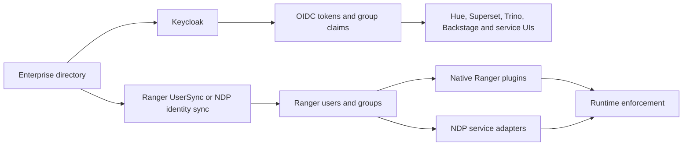

## Security model

NDP separates four controls that are often incorrectly combined:

| Control | System | Question answered |
| --- | --- | --- |
| Authentication | Keycloak using OIDC | Who is the user or workload? |
| Data authorization | Apache Ranger and service adapters | May this principal perform this action on this data resource? |
| Kubernetes admission and configuration policy | Kyverno | May this Kubernetes object be created in this form? |
| Network policy | Cilium | May these endpoints communicate? |

OPA is optional for components that already expose an OPA decision hook, but it is not the central data-policy manager in this architecture.

## Identity flow



OIDC login and Ranger identity synchronization are separate flows. Ranger UserSync normally consumes a supported directory source; if Keycloak is not backed by that same source, NDP needs a tested Keycloak-to-Ranger user/group synchronization adapter.

Use immutable subject identifiers internally and retain human-readable names as attributes. Define how group renames, deletion, nested groups and service accounts propagate.

## Ranger as central policy manager

Ranger is the common policy model, administration API and audit integration point. Enforcement remains decentralized:

| Service | Enforcement approach |
| --- | --- |
| Kafka and other services with supported Ranger plugins | Use and maintain the native Ranger plugin |
| Trino | Validate the selected Ranger access-control integration against the exact Trino release and all required resource types |
| ClickHouse | NDP adapter translates approved policies into native roles, grants, row policies and masking policies; reconciliation and drift detection are mandatory |
| SeaweedFS | NDP adapter translates bucket/prefix policy into S3 IAM or native controls; table-level policy remains enforced through query engines/catalog |
| Polaris | Adapter maps the central resource model to Polaris principal roles and catalog roles where possible |
| PostgreSQL and MySQL | Prefer native database roles and grants reconciled by an adapter; do not place a remote policy call in every SQL authorization path without performance testing |
| Spark | Enforce data access at catalog, query-engine and storage boundaries; Kubernetes job admission controls who may launch compute |

An adapter may either embed a Ranger plugin for runtime decisions or reconcile policies into native ACLs. The latter is usually safer when a service has a mature native permission model, but it introduces propagation delay and drift-management requirements.

## Canonical policy model

Every adapter should consume a stable resource model:

```text
principal: user | group | service-account
service: trino | kafka | clickhouse | seaweedfs | polaris | database
resource: tenant/domain/catalog/schema/table/column/topic/bucket/prefix/database
action: discover | select | insert | update | delete | create | alter | administer
conditions: environment, data-classification, time, client or network context
effects: allow | deny | mask | row-filter
```

Not every backend supports every condition or effect. The UI and API must reject unsupported combinations rather than silently weakening policy.

## Git and Ranger source of truth

NDP must choose one authoritative write path. The recommended model is:

1. Backstage collects the requested policy change and required justification.
2. The change becomes a reviewed Forgejo pull request containing declarative policy files.
3. After merge, a policy reconciler validates and publishes policies to Ranger.
4. Ranger plugins or adapters distribute and enforce the result.
5. Drift detection reports direct changes made in Ranger or target services.

In this model, Git is authoritative and the Ranger UI is primarily used for inspection, troubleshooting and audit. Allowing unrestricted direct edits in both Git and Ranger creates a two-master conflict and should be avoided.

## Adapter contract

Every NDP Ranger adapter must provide:

- Versioned mapping from the canonical resource model to native resources.
- Capability discovery and validation of unsupported policy features.
- Idempotent reconciliation, deletion handling and drift detection.
- Clear fail-open or fail-closed behavior for outages.
- Propagation-latency metrics and end-to-end authorization tests.
- Audit correlation using principal, request, policy version and resource identifiers.
- Compatibility tests against every supported service version.

Custom adapters are product code, not deployment glue. They require ownership, release management and security review.

## Secrets and workload identity

- Do not store plaintext credentials in Git.
- Select a dedicated secret-management design, such as OpenBao/Vault with External Secrets Operator or an encrypted Git workflow.
- Prefer short-lived workload identity and scoped object-store credentials where services support them.
- Rotate database, Kafka and S3 credentials without rebuilding application images.

## Audit

Authentication, Ranger decisions, adapter changes, service-native grants and denied requests should share a correlation model and flow into the observability platform. Security audit retention and access must be isolated from ordinary tenant logs.
