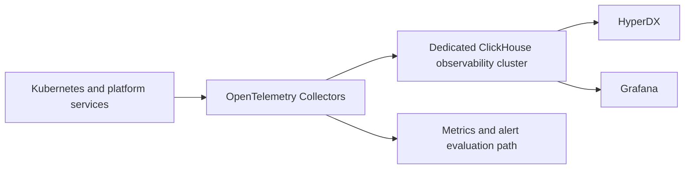

## Target flow



OpenTelemetry is the common collection and context-propagation standard. ClickHouse stores high-volume telemetry. HyperDX provides log and trace investigation, while Grafana provides dashboards and operational views.

## Isolation rule

Observability must not depend on the same ClickHouse deployment or resource quota as customer analytical workloads. A customer query incident must not make the platform blind.

At minimum, isolate:

- Kubernetes namespace and service account.
- Koordinator quota and priority.
- ClickHouse databases, users and retention policies.
- Storage and failure domain where the service objective requires it.
- Security audit data from general application telemetry.

## Telemetry coverage

| Domain | Required signals |
| --- | --- |
| Talos and Kubernetes | Node health, API health, scheduling, eviction, pod lifecycle and certificates |
| Cilium | Flows, drops, policy verdicts, BGP sessions and load-balancer health |
| LINSTOR/DRBD | Volume health, replication lag, disk state, rebuilds and capacity |
| Koordinator | Quota use, borrowing, throttling, preemption, queue wait and colocation interference |
| Trino | Query states, queue time, latency, failures, memory, worker saturation and autoscaling events |
| Spark | Application and stage duration, executor failures, shuffle, retries and queue wait |
| SeaweedFS | Capacity, latency, errors, replication/erasure-coding health and S3 operations |
| Polaris/HMS/OpenMetadata | API latency, metadata operations, ingestion status and catalog errors |
| Airbyte/Dagster | Run state, retry, freshness, connector health and data asset lineage |
| Ranger/Keycloak | Authentication outcomes, policy decisions, sync lag and adapter reconciliation |

## Correlation model

Propagate common attributes where possible:

```text
tenant.id
environment
service.name
workload.id
pipeline.run.id
query.id
user.subject
data.domain
catalog/schema/table or topic
policy.version
```

Sensitive SQL text, object names and user attributes require redaction and role-based access.

## Alerting gap

Grafana and a ClickHouse telemetry store do not by themselves define a complete paging system. Select and document the metric evaluation, alert routing, deduplication, escalation and on-call integration. Preserve a minimal independent health path for incidents affecting the main observability cluster.

## Service objectives

Define objectives for platform availability, query latency, job start delay, pipeline freshness, policy propagation, catalog operations, object-storage durability and restore time. Dashboards should be derived from these objectives, not only from component metrics.
