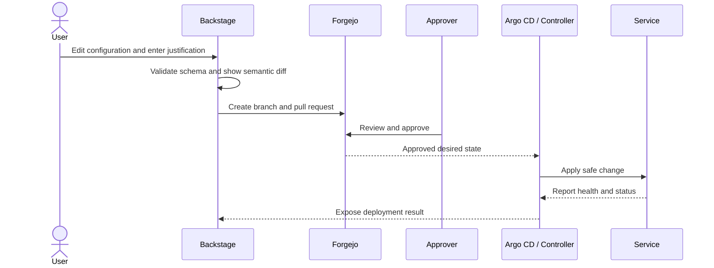

## Objective

NDP provides an Ambari/Cloudera Manager-like configuration experience while retaining Git review, history, diff and rollback semantics.

## Component roles

| Component | Role |
| --- | --- |
| Backstage | User portal, service catalog, validated configuration forms and change workflow |
| NDP configuration plugin | Reads schemas, renders service-specific forms, computes diffs and creates change proposals |
| Forgejo | Authoritative Git repositories, pull requests, reviews, comments, commit history and audit trail |
| Argo CD | Reconciles Kubernetes resources from approved Git state |
| Service operators/controllers | Translate desired state into safe service-specific API and lifecycle operations |
| Keycloak | OIDC login and administrative group mapping |

Backstage is the experience layer, not the source of truth. Forgejo stores approved desired state, and Argo CD or a controller performs reconciliation.

## Change workflow



The required comment becomes the pull-request description and commit message. The UI should show both the declarative diff and the operational impact, such as restart, rolling restart, online reload or migration.

## Configuration repository layout

```text
environments/
  production/
    clusters/<cluster>/
      platform/
      services/
        trino/
        spark/
        clickhouse/
        kafka/
      tenants/<tenant>/
      policies/
  staging/
schemas/
  services/
templates/
  backstage/
```

Use overlays only where they make ownership clear. Avoid deep inheritance that hides the final value shown to operators.

## Configuration contract

Each managed component needs a versioned schema containing:

- Type, default, allowed values and validation rules.
- Whether a setting is global, cluster, tenant or workload scoped.
- Whether the change is online, rolling, disruptive or immutable.
- Dependencies and incompatible combinations.
- Secret/reference handling.
- Supported component versions.
- Health checks and rollback behavior.

Generated forms should be schema-driven so the portal and controller apply the same validation.

## Reconciliation boundaries

- Argo CD handles Kubernetes-native desired state such as Helm releases, operators and custom resources.
- A service-specific controller handles runtime APIs or databases that Argo CD cannot safely reconcile directly.
- Mutable emergency actions, such as killing a query or pausing a pipeline, are operational commands and do not need a Git commit.
- Durable changes to quotas, service configuration, tenant definitions and policies return to Git.
- Secrets are referenced from Git but stored in the selected secret manager.

## Drift and rollback

- Detect changes made directly through a service API or UI.
- Show drift in Backstage and block silent overwrites of unknown changes.
- Rollback is a new reviewed Git change, not history deletion.
- Controllers report whether rollback is safe; stateful schema changes may require a forward repair.
- Record desired version, observed version, rollout state and health for every service instance.

## Backstage scope

Start with software templates and a focused NDP configuration plugin. Do not attempt to clone every Cloudera Manager screen. Prioritize the workflows that benefit from standardization: tenant onboarding, service creation, configuration change, policy request, capacity request and upgrade.

## References

- [Backstage Software Templates](https://backstage.io/docs/features/software-templates/)
- [Argo CD documentation](https://argo-cd.readthedocs.io/)
- [Forgejo documentation](https://forgejo.org/docs/latest/)
