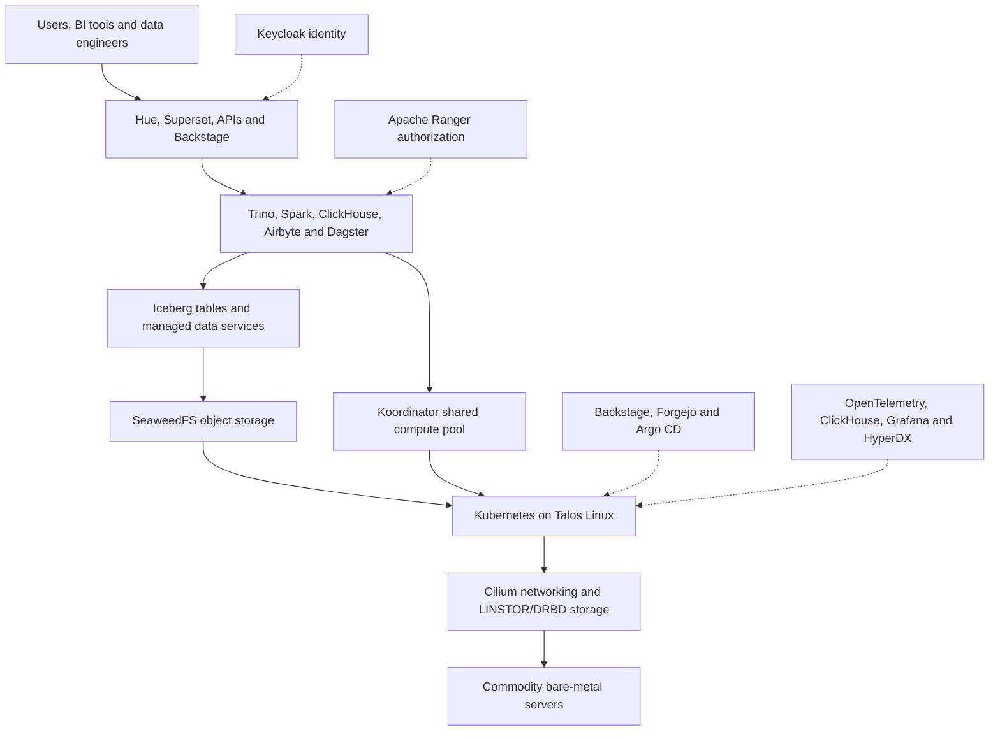

NDP combines a lakehouse, interactive SQL, distributed processing, ingestion,
orchestration, managed data services, and a common operational control plane.

:::note
This documentation describes NDP. Technologies shared with other platforms are
implementation references only and do not define the identity or scope of NDP.
:::

## Architecture at a glance

The solid path is the main data and compute flow. Dotted components are
transverse capabilities applied across the platform.

## Platform objectives

- Replace identified CDP workloads without pretending every product mapping is
  one-to-one.
- Run on immutable Talos Kubernetes clusters installed on commodity bare metal.
- Use open standards such as OIDC, S3, Iceberg REST, OpenTelemetry, SQL, and
  Kubernetes APIs at integration boundaries.
- Protect daytime interactive Trino workloads while allowing batch processing
  to borrow the same compute pool at night.
- Make configuration and policy changes reviewable, attributable, reproducible,
  and reversible through Git.

## Explore the architecture

- [Architecture overview](/architecture)
- [Infrastructure and storage](/architecture/infrastructure)
- [Resource scheduling](/architecture/resource-scheduling)
- [Lakehouse and metadata](/architecture/lakehouse)
- [Data services](/architecture/data-services)
- [Ingestion and orchestration](/architecture/ingestion-orchestration)
- [Identity and authorization](/architecture/security)
- [Observability](/architecture/observability)
- [GitOps control plane](/architecture/control-plane)
- [CDP migration](/architecture/cdp-migration)
- [Open decisions](/architecture/open-decisions)
